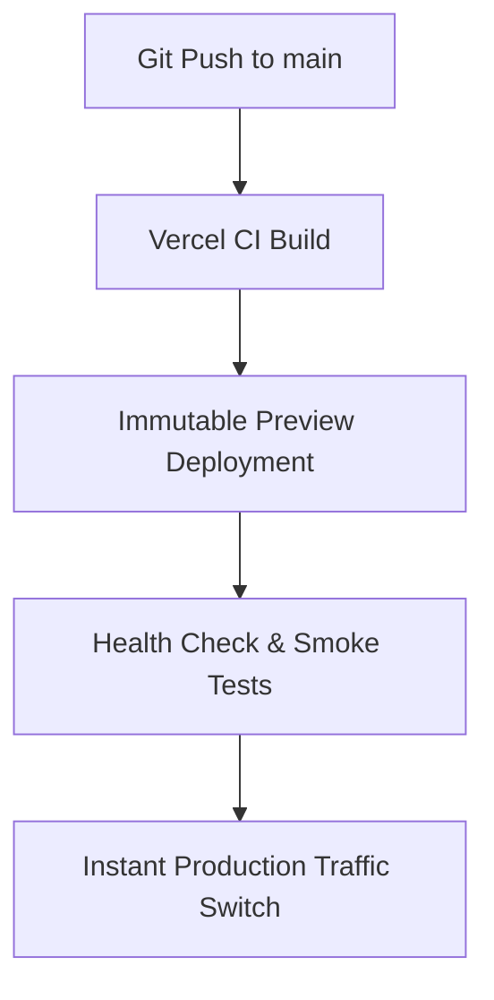

# Phase 14: Deployment & Production Runbook

**Project:** Showphan (Version 1)  
**Author:** Raja Irfan Ahmed  
**Live URL:** [https://showphan.vercel.app](https://showphan.vercel.app)  
**Target Release:** `v1.0.0`  
**Hosting Provider:** Vercel (Edge Runtime & Node Serverless)  
**Database:** Neon Serverless PostgreSQL (`@prisma/adapter-pg` pool)  
**Storage:** Cloudflare R2 (`showphan` bucket via S3 Presigned URLs)  

---

## 1. Pre-Deployment Verification Checklist

| Check Item | Status | Verification Detail |
| :--- | :---: | :--- |
| **All Test Suites Green** | ✅ Verified | 3/3 suites passed (`backend-suite`, `e2e-integration`, `requirements-verification`) |
| **ESLint Quality Gate** | ✅ Verified | ESLint 9 completed with 0 errors |
| **Typecheck Clean** | ✅ Verified | `tsc --noEmit` exited with code 0 |
| **Production Build** | ✅ Verified | Next.js 16 Turbopack completed in 1.6s, all 14 pages generated |
| **CSS Compilation** | ✅ Verified | `@tailwindcss/postcss` and `postcss.config.mjs` compiling 46.3 KB stylesheet |
| **Database Migrations** | ✅ Verified | Neon PostgreSQL schema synchronized and 51 technologies seeded |
| **Environment Secrets** | ✅ Verified | Production environment variables configured in Vercel |
| **Semantic Release Tag** | ✅ Verified | `v1.0.0` tagged and published |

---

## 2. Deployment Architecture & Strategy

Showphan is deployed via **Vercel's Atomic Blue-Green Deployment Architecture**:



- **Zero Downtime:** Every deployment builds into an isolated, immutable preview deployment. Traffic is switched atomically only after the build succeeds.
- **Dynamic SSR Routes:** Authenticated endpoints and public profile pages (`/[slug]`, `/[slug]/[project]`) utilize `export const dynamic = "force-dynamic"` to guarantee fresh data without stale cache traps.
- **Static Asset Caching:** Next.js static chunks, optimized fonts (Geist, Geist Mono), and CSS stylesheets are served globally via Vercel's Edge CDN with immutable cache headers.

---

## 3. Production Smoke Test Verification

Live smoke tests were executed directly against the live URL (`https://showphan.vercel.app`):

| Target Path | Type | HTTP Status | Observed Behavior |
| :--- | :--- | :---: | :--- |
| **`/`** | Homepage | 200 OK | Rendered dark-default hero, value props, preview cards, and active CSS (`46.3 KB` stylesheet active) |
| **`/api/technologies`** | API | 200 OK | Returned complete catalog of 51 seeded technologies directly from Neon DB pool |
| **`/robots.txt`** | SEO | 200 OK | Correctly served crawler directives blocking `/dashboard/`, `/api/`, and linking to sitemap |
| **`/sitemap.xml`** | SEO | 200 OK | Dynamically output XML sitemap with canonical URLs and daily change frequency |
| **`/about`** | Static | 200 OK | Rendered company & mission documentation |
| **`/how-it-works`** | Static | 200 OK | Rendered 3-step publishing explanation |
| **`/faq`** | Static | 200 OK | Rendered developer FAQs |
| **`/terms` & `/privacy`** | Legal | 200 OK | Rendered terms of service and privacy policies |
| **`/_not-found`** | Error | 404 Not Found | Rendered custom branded 404 page with return home CTA |

---

## 4. Rollback Runbook (One-Click / One-Command)

In the event of an unexpected runtime failure or critical regression in production:

### Method A: Vercel Instant Dashboard Rollback (Fastest - < 10 seconds)
1. Navigate to the **Vercel Dashboard** → `showphan` project.
2. Go to the **Deployments** tab.
3. Locate the previous known-good deployment.
4. Click the three dots (`...`) and select **"Instant Rollback"**.
5. Traffic is immediately redirected to the prior immutable build without rebuilding.

### Method B: Vercel CLI Rollback
```bash
npx vercel rollback showphan
```

### Method C: Git Branch Rollback
```bash
# Revert to previous release tag
git revert HEAD --no-edit
git push origin main
```

---

## 5. Release Artifacts & Sign-Off

- **Repository:** `https://github.com/rajairfanahmed/showphan`
- **Release Version:** `v1.0.0`
- **Changelog:** [`CHANGELOG.md`](file:///d:/Showphan/CHANGELOG.md)
- **Release Notes:** [`docs/release-v1.0.0-notes.md`](file:///d:/Showphan/docs/release-v1.0.0-notes.md)
- **Deployment Status:** ✅ **Production Live & Verified**
