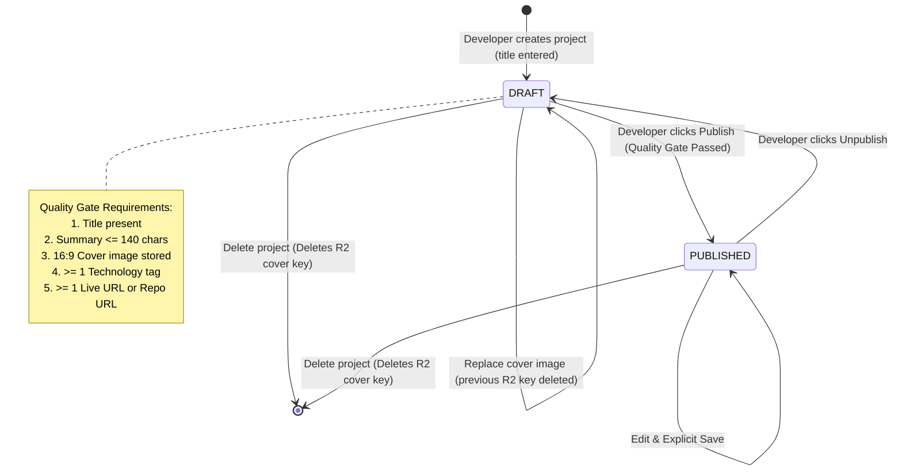

# System Analysis: Showphan (Version 1)

This document represents the Phase 3 (System Analysis) deliverable. It provides a formal audit of `requirements.md`, technical feasibility assessment, domain data modeling with state transitions, and deep component boundaries.

---

## 1. Consistency & Completeness Audit Findings

| Category | Finding / Identified Gap | Resolution / Audit Outcome |
| :--- | :--- | :--- |
| **Edge Case: Concurrent Edits** | If a developer edits the same project across two open tabs or devices, silent overwrites could occur. | **Resolved:** Enforce optimistic concurrency control using `updated_at` timestamp comparison. If the incoming payload's `updated_at` does not match the current DB state, reject with `409 Conflict` (`"This project was modified in another session. Please reload."`). |
| **Edge Case: Upload Cancellation / Orphaned Assets** | If a developer uploads an image to Cloudflare R2 but cancels the form or closes the tab before saving the project record, the image remains orphaned in storage. | **Resolved:** Form autosave immediately links the newly uploaded image key to the draft project. A daily scheduled cleanup job checks for unreferenced R2 keys older than 24 hours and purges them. |
| **Edge Case: GitHub Slug Collision** | If a user's GitHub username matches a reserved route (e.g., `admin`, `api`, `dashboard`), direct slug mapping breaks application routing. | **Resolved:** Reserve word collision check during onboarding. If the username matches a reserved keyword, append `-dev` or a numeric suffix (e.g., `admin-dev`). |
| **Edge Case: Rate Limiting on External APIs** | GitHub unauthenticated API rate limits are capped at 60 requests/hour. Fetching star counts or repository metadata under burst traffic would fail. | **Resolved:** Repository stars are cached on the server for 60 minutes. Metadata import uses the authenticated developer's OAuth access token on the server (5,000 req/hr). |
| **NFR Clarification: Image Constraints** | Blueprint stated "around 1600px and around 1MB". | **Resolved & Quantified:** Strict enforcement: Client resizes to max width 1600px at WebP quality 0.85. Server-side presigned upload policy enforces `content-length-range` between 1 KB and 1,048,576 Bytes (1MB max). |

---

## 2. Refined Requirements List

Following the audit, the core requirements have been refined:
1. **US-2.6 (Optimistic Locking):** All project write actions compare `updated_at`. Stale writes return a clear reload prompt.
2. **US-3.6 (Asset Lifecycle):** Presigned URL generation logs an upload intent with a 15-minute TTL. Unbound keys are eligible for scheduled sweep.
3. **BR-7.1 (Slug Disambiguation):** Reserved words are rejected and automatically given a safe `-dev` suffix during first-time slug generation.
4. **NFR-2.1 (Edge Caching Strategy):** Public profile routes (`/[slug]`) and project routes (`/[slug]/[project]`) utilize Next.js Incremental Static Regeneration (ISR) with `revalidate = 60` or on-demand revalidation when the developer publishes updates.

---

## 3. Technical Feasibility Assessment

### 3.1 Neon PostgreSQL Connection Pooling
- **Constraint:** Neon computes enter idle state after 5 minutes of inactivity on the free tier. Re-waking the compute introduces a 1.0–2.5 second cold start latency.
- **Feasibility Impact:** Acceptable for authenticated dashboard writes, but unacceptable for public visitors.
- **Mitigation:** Public pages (`/[slug]` and `/[slug]/[project]`) are rendered with ISR and cached at the Vercel Edge. Visitors hit edge cache, completely bypassing the Neon database during idle states. Writes and dashboard reads connect via `@prisma/adapter-pg` through Neon's pooled connection (`-pooler`).

### 3.2 Client-Side Image Processing & R2 Direct Upload
- **Constraint:** Vercel serverless functions have a 4.5MB request payload limit on the hobby tier, and server-side image processing consumes execution time.
- **Feasibility Impact:** Routing raw images through Next.js API routes would strain memory and time limits.
- **Mitigation:** The client browser performs canvas-based resizing to 1600px max and converts to WebP. The client requests a presigned PUT URL from `/api/uploads/cover` and uploads directly to Cloudflare R2, completely bypassing Vercel serverless functions for file transfer.

### 3.3 Offline Iconify Bundling
- **Constraint:** Downloading SVGs at runtime from the Iconify API causes layout shifts and external API failure risk. Full Iconify npm packages are hundreds of megabytes.
- **Feasibility Impact:** Bundling full icon sets would bloat the build.
- **Mitigation:** Use `@iconify/utils` to extract only the curated ~40 technologies at build time into a compact single JSON file (`src/generated/icons.json`, ~45 KB). The client renders using `@iconify/react/offline`'s `addCollection`.

---

## 4. Domain Data Model & State Transitions

### 4.1 Entity Relationship Diagram

```mermaid
erDiagram
  USER ||--o{ SESSION : has
  USER ||--o{ ACCOUNT : links
  USER ||--o{ PROJECT : owns
  PROJECT ||--o{ PROJECT_TECHNOLOGY : uses
  TECHNOLOGY ||--o{ PROJECT_TECHNOLOGY : referenced_in

  USER {
    string id PK
    string github_id UK
    string slug UK
    string display_name
    string bio
    string avatar_url
    boolean search_visible
    datetime created_at
    datetime updated_at
  }

  PROJECT {
    string id PK
    string user_id FK
    string slug UK_per_user
    string title
    string summary
    string description
    string cover_image_key
    string live_url
    string repo_url
    string role
    string learnings
    string[] tags
    string status
    boolean is_featured
    int position
    datetime created_at
    datetime updated_at
  }

  TECHNOLOGY {
    string id PK
    string name UK
    string slug UK
    string icon_color
    string icon_mono
  }

  PROJECT_TECHNOLOGY {
    string project_id PK,FK
    string technology_id PK,FK
  }
```

### 4.2 Project Lifecycle State Machine



### 4.3 Data Flow Map

1. **Authentication Flow:**
   `Browser` → `Better Auth` → `GitHub OAuth` → `Upsert User & Session` → `Issue HTTP-only Cookie`.
2. **Cover Image Upload Flow:**
   `Browser (WebP 1600px)` → `POST /api/uploads/cover` → `S3 Presigned URL (15m TTL)` → `Browser direct PUT to R2` → `Form links cover_image_key`.
3. **Public Read Flow:**
   `Visitor` → `Vercel Edge (ISR Cache)` → *(Cache Hit)* → `HTML & OpenGraph rendered`.
   *(If Cache Miss / Stale)* → `Server Component` → `Neon Pooler Query (published only)` → `Update Cache`.

---

## 5. Component Boundaries & Seam Definition

The application is decomposed into five **Deep Modules**. Each module exposes a minimal interface and encapsulates its internal implementation.

```
                      ┌────────────────────────────────┐
                      │        App Router UI           │
                      │  (Pages, Server Components)    │
                      └──────────────┬─────────────────┘
                                     │
         ┌───────────────┬───────────┴───────────┬───────────────┐
         ▼               ▼                       ▼               ▼
┌─────────────────┐ ┌─────────────────┐ ┌─────────────────┐ ┌─────────────────┐
│   Auth Module   │ │ Projects Module │ │ Storage Module  │ │ Catalog Module  │
│ (Better Auth +  │ │(CRUD, Ordering, │ │(R2 Presigning,  │ │(Iconify Bundle, │
│  GitHub OAuth)  │ │ Quality Gate)   │ │  Image Purging) │ │ Tech Database)  │
└────────┬────────┘ └────────┬────────┘ └────────┬────────┘ └────────┬────────┘
         │                   │                   │                   │
         └───────────────────┴─────────┬─────────┴───────────────────┘
                                       ▼
                       ┌────────────────────────────────┐
                       │      Core Database Module      │
                       │   (Prisma Client + Neon Pool)  │
                       └────────────────────────────────┘
```

### Module 1: Auth Module (`src/lib/auth/`)
- **Responsibility:** Manages GitHub OAuth handshake, session verification, user account creation, and route protection.
- **Interface (Seam):**
  - `auth`: Server-side Better Auth handler.
  - `authClient`: Client-side React hooks (`useSession`, `signIn`, `signOut`).
  - `getCurrentUser()`: Cached server-side session retriever.
- **Hidden Complexity:** OAuth token exchange, CSRF validation, HTTP-only cookie signing.

### Module 2: Projects Module (`src/lib/projects/`)
- **Responsibility:** Owns all project CRUD logic, positioning sequence, optimistic locking, and Quality Gate rule evaluation.
- **Interface (Seam):**
  - `getPublicProfile(slug)`: Returns developer info and published projects.
  - `getPublicProject(userSlug, projectSlug)`: Returns standalone project details.
  - `saveProjectDraft(input)`: Validates and persists draft state.
  - `publishProject(projectId)`: Validates Quality Gate and transitions to published.
  - `deleteProject(projectId)`: Triggers cascade deletion in DB and queues image purge.
- **Hidden Complexity:** Relational join queries, 30-project / 6-featured limits, markdown sanitization.

### Module 3: Storage Module (`src/lib/storage/`)
- **Responsibility:** Direct integration with Cloudflare R2 via AWS S3 SDK.
- **Interface (Seam):**
  - `getPresignedCoverUploadUrl(userId, fileType)`: Generates a signed PUT URL and object key.
  - `deleteCoverImage(key)`: Deletes an object from the R2 bucket.
- **Hidden Complexity:** S3 signature v4 generation, bucket policy headers, error handling for missing objects.

### Module 4: Catalog & Icon Module (`src/lib/catalog/`)
- **Responsibility:** Standardized technology tags, slug mapping, and offline icon definitions.
- **Interface (Seam):**
  - `getTechnologies()`: Returns the list of available technologies.
  - `renderTechIcon(slug, mode)`: Renders brand or monochrome SVG icon from offline collection.
- **Hidden Complexity:** Iconify JSON parsing, build-time extraction script.

### Module 5: Showcase & SEO Module (`src/lib/seo/`)
- **Responsibility:** Generates OpenGraph/Twitter Card images, metadata tags, structured JSON-LD data, and dynamic XML sitemaps.
- **Interface (Seam):**
  - `generateProfileMetadata(slug)`: Standard Next.js metadata generator.
  - `generateProjectMetadata(userSlug, projectSlug)`: Next.js project metadata generator.
  - `generateJsonLd(type, data)`: Schema.org JSON-LD generator for WebSite/Profile/CreativeWork.
- **Hidden Complexity:** `noindex` rules for empty profiles, absolute URL normalization.

---

## 6. Feasibility Risks & Mitigation Summary

| Risk | Likelihood | Impact | Architectural Mitigation |
| :--- | :--- | :--- | :--- |
| **Neon Compute Dormancy (Cold Start)** | High | Medium | ISR Edge Caching for all public views (`/[slug]` and `/[slug]/[project]`). Database is only contacted on dashboard writes and cache refreshes. |
| **Vercel Hobby Serverless Timeout (10s)** | Medium | High | Offload image uploading to client-to-R2 presigned PUTs. Zero heavy image processing on Vercel functions. |
| **Client-Side Image Manipulation Inconsistency** | Low | Medium | Client canvas scales and compresses to WebP. Server enforces strict content-length and MIME type validation before accepting storage keys. |
| **Unreferenced Image Accumulation** | Medium | Low | Immediate key linking upon draft save; daily Vercel Cron sweeper to clean up unreferenced R2 files older than 24 hours. |
